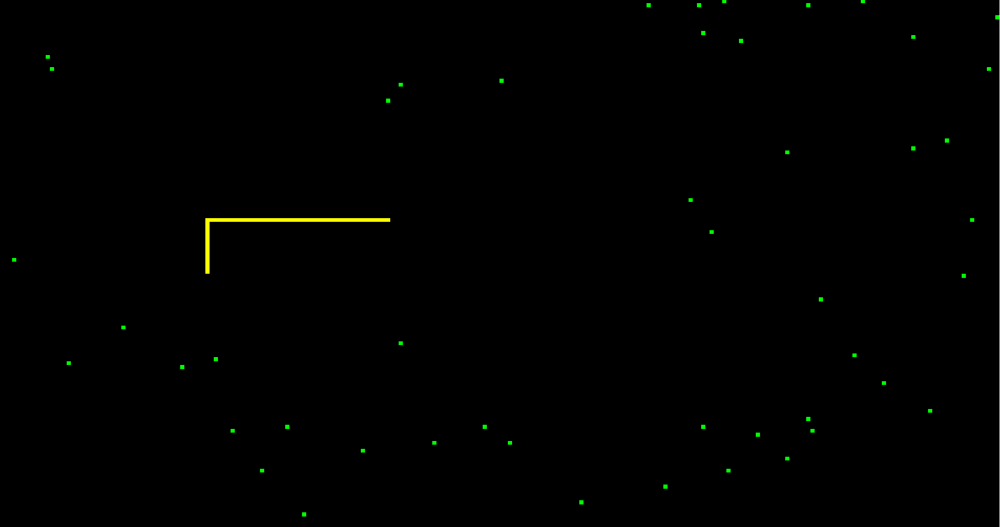

# Buts

- Implémentation d’une file d’attente.
- Implémentation d’un jeu.
- Utilisation de fonctions et de SDL2.
- Allocation dynamique de mémoire.
- Utilisation de `git` et de `make`.

# Énoncé

{#fig:serpent width=80%}

Implémenter un "jeu du serpent" (voir figure \ref{snake}) avec les règles suivantes :

- le serpent avance toujours tout droit (dans sa direction courante) tant que la joueuse ne modifie pas la direction ;
- la joueuse peut modifier la direction de déplacement du serpent à l’aide des touches suivantes[^3] :
  - `a`: déplacement vers la gauche,
  - `s`: déplacement vers le bas,
  - `d`: déplacement vers la droite,
  - `w`: déplacement vers le haut ;
- le serpent démarre avec une longueur de 3 ;
- le serpent démarre en étant orienté vers la droite au milieu de l'écran de jeu ;
- il y a un nombre maximal, `N`[^1], de nourriture qui apparait à des endroits aléatoires de la carte toutes les `M`[^2] secondes ;
- lorsque le serpent "mange" de la nourriture sa longueur augmente de un et la nourriture disparait ;
- l'écran de jeu est entouré d’une paroi ;
- le serpent meurt si :
  - sa tête rencontre une paroi,
  - si sa tête rencontre son corps,
  - si le serpent tente de faire un "demi-tour" immédiat (p.ex. il se déplace vers la droite et on essaie de le faire se déplacer vers la gauche) ;
- la partie se termine par une victoire si le serpent occupe tout l’écran ;
- la touche `escape` arrête le jeu.

L’interaction avec la joueuse (affichage graphique, touches du clavier) se fait avec la librairie SDL2.
Pour l’affichage, il est recommandé d’avoir des épaisseurs de un pixel pour tous ces objets (cela simplifie grandement l’implémentation).

Bien entendu vous devez utiliser `git` et `make` pour la gestion et la compilation de votre projet.

# Cahier des charges

Chaque segment du serpent est en fait un pixel : il est représenté par sa position (ses coordonnées `x`, `y` qui sont des entiers) soit une structure de donnée du genre

```C
struct coord {
    int x, y;
};
```

Le serpent est une file d’attente contenant la position des pixels qu’il occupe.
Lorsque le serpent se déplace, il faut retirer l’élément du devant de la file, et insérer le nouvel élément à l’arrière de la file :
la tête du serpent est l’arrière de la file, et la queue du serpent est l’avant de la file.

Sans intervention de la joueuse, le serpent ne changera pas de direction de déplacement.
Il faut donc stocker cette information.
La nourriture ne se déplace jamais, et est uniquement déterminée par sa position sur l’écran.

Afin de déterminer si le serpent meurt ou mange de la nourriture, il est recommandé d’utiliser le tableau de pixels utilisé pour l’affichage.
Vous pouvez définir un type énuméré avec quatre variantes (`empty`, `snake`, `food`, et `wall` par exemple) correspondant à des couleurs `COLOR_BLACK`, `COLOR_WHITE`…
Ainsi en récupérant la valeur des pixels vous pouvez savoir quel type d’élément se trouve à une position donnée.

## Attention

Pour que le jeu soit "jouable", il faut éviter de mettre à jour son état trop souvent (le serpent bougerait trop vite).
Il est judicieux de n’afficher qu’un certain nombre de frames par seconde (ou en d’autres termes fixer le temps qu’il faut entre l’affichage de chaque frame, $t_f$).
Pour ce faire, il faut mesurer le temps nécessaire à l’affichage d'une frame (voir plus bas), puis faire attendre votre programme le temps nécessaire pour qu’on attende $t_f$ avant l’affichage de la frame suivante (voir la fonction `usleep()` par exemple).

# Critères d’évaluation

* Forme : qualité du dépôt Git, structure du code, documentation, **2 points**
* Fonctionnalités : le code répond au cahier des charges, **4 points**
* Créativité : votre programme ne se contente pas du minimum syndical, vous avez implémenté une ou des fonctionnalités originales, **2 points**
* Présentation : vous êtes capable de m’expliquer ce que vous avez fait et de justifier vos choix, **2 points**

Ce travail aura un coefficient de 1 par rapport aux deux autres évaluations du semestre.

Le rendu est fixé au **dimanche 1^er^ juin, 23h59**.
Vous devez me partager votre dépôt avec comme accès *developer*.


# Remarques

## Implémentation d’une file d’attente

Votre file d’attente doit être implémentée à l’aide d’une liste chainée comme vue en classe.

## Affichage graphique

Il faut [installer la lib SDL2](https://wiki.libsdl.org/SDL2/Installation) sur votre machine.
Sur la majorité des machines, vous devriez vous en sortir avec les paquets `libsdl2-2.0.0`, `libsdl2-dev` et `libsdl2-gfx-dev`.

Vous trouverez la librairie GFX avec un main d’exemple sur [ce lien](gfx.tar.gz).
**Attention** : n’oubliez pas qu’il faut faire l’édition des liens avec le flag : `-lSDL2` sinon vous aurez une erreur.

Un certain nombre des fonctions suivantes pourraient vous être utiles (elles ne sont pas toutes dans `gfx.h/c`) :

- `gfx_getpixel()`, renvoie la "couleur" du pixel à une position `x`, `y` donnée en argument ;
- `gfx_putpixel()`, donne une "couleur" donnée en argument au pixel se trouvant à une position `x`, `y` donnée ;
- `gfx_keypressed()` renvoie le code de la touche pressée par la joueuse[^4] ;
- `usleep()` (se trouvant dans `unistd.h`) met le programme en pause pendant un certain nombre de microsecondes passé en argument.

## Mesure du temps d’affichage d’une frame

La mesure du temps d’exécution d’une partie de votre programme se fait grâce à la librairie `<time.h>`{.C}.
Un exemple d’utilisation est donné par les lignes suivantes

```C
struct timespec start, finish;
clock_gettime(CLOCK_MONOTONIC, &start);
// Algorithme de mise à jour d'une frame
clock_gettime(CLOCK_MONOTONIC, &finish);
float elapsed = (finish.tv_sec - start.tv_sec);
printf("elapsed seconds = %f\n", elapsed);
```

[^1]: Un argument de votre programme.
[^2]: Autre argument de votre programme.
[^3]: Vous pouvez aussi utiliser les flèches.
[^4]: Tous les codes clavier se trouvent à l’adresse <https://wiki.libsdl.org/SDL_Keycode>.
